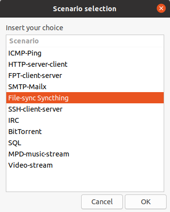
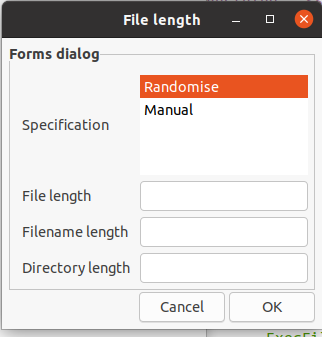
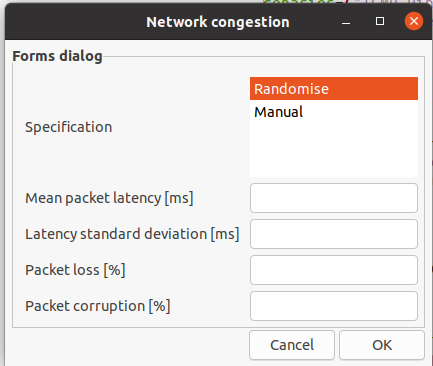

# DetGen: Deterministic traffic generation and capture

## What is this?

DetGen is a set of scripts and conventions for capturing network traffic and logging information from self-contained
"scenarios" which are run inside Docker containers.  The scenarios can be easily re-run to regenerate traffic with
or without variation.  In contrast to capturing traffic from general VMs or actual workstations, the captures are 
repeatable and more determinstic.  

## Datasets generated for Detlearsom

For the **DetGen-IDS** dataset and the **Stepping-stone dataset** used for publications in the
[Detlearsom project](https://detlearsom.github.io/) , please look for instructions [here](Datasets.md)

## Set-up

1. Install Docker on your machine following these instructions:
   https://docs.docker.com/install/linux/docker-ce/ubuntu/#set-up-the-repository. Note:
   you need `sudo` privileges to do this.
2. Install docker-compose following:
   https://docs.docker.com/compose/install/. Note: you need `sudo`
   privileges to run this.
3. `cd` into the directory where you want to put those project files
   and use `git clone https://github.com/detlearsom/detgen/` to clone
   the repository into your workspace.
4. Follow instructions 2 and 3 in
   https://github.com/detlearsom/detgen/blob/master/containers/README.md.

## Generating traffic 

1. `cd` into the DetGen-directory
2. Run `sudo ./GUI_files/GUI.sh`
3. In the dialogue-field, select the particular traffic scenario, either benign or attack, for which you want to generate traffic 

4. Select the particular activity as well as the corresponding parameters for file-size, caching, congestion etc. You can also choose to randomise them.

  |  

5. Select how many repetitions you want to run.
6. Once done, find your generated traffic in the directory Generated_data

### Release 1.0.0

This release contains all scenarios that are currently in a well-maintained state, namely:

1. HTTP
2. FTP
3. SSH
4. File-Sync
5. BitTorrent
6. SQL
7. IRC
8. NTP
9. Music and Video streaming

and the following attack scenarios:

1. SQL-injections
2. Heartbleed
3. XXE attacks

We are currently working to add a number of additional scenarios to this public release. A list of implemented scenarios can be found in the arXiv preprint "DetGen: Traffic generation using containerization for machine learning". If you need access to any of these scenarios, feel free to get in contact.

Please cite the following paper when using DetGen in your work:

Clausen, Henry, Robert Flood, and David Aspinall. "Traffic generation using containerization for machine learning." arXiv preprint arXiv:2011.06350 (2020).

### Important notes/bugs and fixes

* In some cases (especially on a new Docker installation) using docker-compose gives a Python encoding error. This is (we believe) due to some Python 2/3 differences. This happens when an image is not present on the system and docker-compose is trying to pull it. Those are usually offical builds. If this happens the solution is to run a container and then remove it: `docker run -d image_name:version` and then `docker kill container_id` and `docker rm container_id`.
* Another issue is container startup (most commonly using the script `capture.sh`). What happens is, sometimes a container fails to start properly and then a tcpdump container tries to latch on to the other container's network stack. This ends with an error message. The solution to this is to run 2-3 times `docker-compose up -d` manually from within the folder (don't forget to `docker-compose down` after the error comes up or after you've seen that it works). After that try running the shell script again 1-2 times, which should work. This is solved for containers 20, 21, 22, 40, 41 and 42. The solution is to add a dummy container that depends on the server/main conainers (like nginx and siege) and then make the tcpdump containers depends on the dummy container. This gives enough time for the main containers to initialize properly before tcpdump latches on.

"This project is licensed under the terms of the MIT license."
